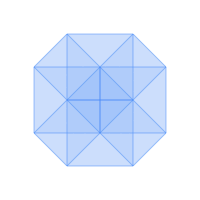
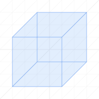

<h1 align="center">
    <br/>
    NCube.js
</h1>

A light-weight JavaScript library that dynamically generates [n-dimensional hypercube](https://en.wikipedia.org/wiki/Hypercube) <i>(or n-cube)</i> geometries.

<div align="center">
    <a href="#getting-started">Getting Started</a> • <a href="#sample-usage">Sample Usage</a> • <a href="#documentation">Documentation</a>
</div>

## Getting Started
### Demo
See the [**interactive demo**](#) for interactive n-dimensional rotation demos and sample usage.

### Browser
```html
<script src="ncube.min.js"></script>
<script>
    const nCube = new NCube(4);
</script>
```

### Node.js Modules
```javascript
import NCube from './ncube.module.js';

const nCube = new NCube(4);
```

## Sample Usage

### Graphing with [SVG.js](https://svgjs.dev/docs/3.0/)

<div align="center">
    
</div>

Graphing the [edges](ncubeedges) and [faces](ncubefaces) of a 3-dimensional hypercube on a 3-dimensional graph.

```html
<script src="path/to/svg.min.js"></script>
<script src="path/to/ncube.min.js"></script>
<script>
    const [width, height] = [200, 200];
    const svg = SVG().addTo(document.body).size(width, height);

    // Converts a Vertex to a 2d point on the SVG
    const to2d = v => [100 + v[0] + v[2] / 2, 100 + v[1] - v[2] / 2];

    // Create a 3-dimensional hypercube (a cube) with bounding coordinates -50, 50
    const nCube = new NCube(3, [-50, 50]);

    // Draw all edges
    nCube.edges.forEach(edge => {
        // https://svgjs.dev/docs/3.0/shape-elements/#svg-line
        // line(x1, y1, x2, y2)
        svg.line(...edge.map(to2d).flat())
            .opacity(0.5)
            .stroke({ color: '#4287f5' });
    });
    
    // Paint all faces
    nCube.faces.forEach(face => {
        // https://svgjs.dev/docs/3.0/shape-elements/#svg-polygon
        // polygon('x1,y1 x2,y2 x3,y3 x4,y4')
        svg.polygon(face.map(v => to2d(v).join(',')).join(' '))
            .opacity(0.075)
            .fill('#4287f5')
    });
</script>
```

### Rotations with [SVG.js](https://svgjs.dev/docs/3.0/)

<div align="center">
    
</div>

[Rotating](#ncuberotate) a 4-dimensional hypercube *(tesseract)* and graphing its [edges](ncubeedges) and [faces](ncubefaces) on a 4-dimensional graph.

```html
<script src="path/to/svg.min.js"></script>
<script src="path/to/ncube.min.js"></script>
<script>
    const [width, height] = [200, 200];
    const svg = SVG().addTo(document.body).size(width, height);

    // Converts a Vertex to a 2d point on the SVG
    const to2d = v => [100 + v[0] + v[2] / 2 + v[3] / 2, 100 + v[1] - v[2] / 2 + v[3] / 2];

    // Create a 4-dimensional hypercube (a tesseract) with bounding coordinates -25, 25
    const nCube = new NCube(4, [-25, 25], {
        draw: function() {
            // Draw all edges
            this.edges.forEach(edge => {
                // https://svgjs.dev/docs/3.0/shape-elements/#svg-line
                // line(x1, y1, x2, y2)
                svg.line(...edge.map(to2d).flat())
                    .opacity(0.5)
                    .stroke({ color: '#4287f5' });
            });
            // Paint all faces
            this.faces.forEach(face => {
                // https://svgjs.dev/docs/3.0/shape-elements/#svg-polygon
                // polygon('x1,y1 x2,y2 x3,y3 x4,y4')
                svg.polygon(face.map(v => to2d(v).join(',')).join(' '))
                    .opacity(0.075)
                    .fill('#4287f5')
            });
        }
    });

    let angle = 0;
    const rotate = setInterval(() => {
        svg.clear();
        // Reset the hypercube, rotate over ZW, XY, and YZ planes, and draw
        nCube.reset().rotate(angle/100, [[0, 1], [2, 3], [3, 1]]).draw();    
        // Restart rotation when angle = 630
        angle = angle === 629 ? 0 : angle + 2;
    }, 25);
</script>
```

### Rotations with [Three.js](https://threejs.org/docs/index.html#manual/en/introduction/Creating-a-scene)

<div align="center">
    
</div>

[Rotating](#ncuberotate) a 4-dimensional hypercube *(tesseract)* and [projecting](#vertexproject) it into 3-dimensional space.

```html
<script src="path/to/three.min.js"></script>
<script src="path/to/ncube.min.js"></script>
<script>
    // Set up our Three.js environment and create our line material
    const scene = new THREE.Scene();
    const camera = new THREE.PerspectiveCamera(75, 200 / 200, 0.1, 1000);
    const material = new THREE.LineBasicMaterial({ color: "#4287f5" });
    const renderer = new THREE.WebGLRenderer({ alpha: true }); 
    scene.rotateX(-Math.PI / 2), camera.position.z = 1;
    renderer.setClearColor(0x000000, 0), renderer.setSize(300, 300);
    document.body.appendChild(renderer.domElement);

    // Create an array to store our edge geometries
    const edges = [];

    // Create a 4-dimensional hypercube
    const nCube = new NCube(4, [-1, 1], {
        renderEdges: function() {
            // Render each edge
            this.edges.forEach((edge, i) => {
                // Create new geometry (https://threejs.org/docs/#api/en/objects/Line)
                const geometry = new THREE.BufferGeometry().setFromPoints(
                    // with the 3-dimensional projections of the verticies in the edge
                    edge.map(vertex => new THREE.Vector3(...vertex.project(3, 4)))
                );

                if (edges[i]) {
                    // Either update the existing geometry,
                    edges[i].geometry.dispose();
                    edges[i].geometry = geometry;
                } else {
                    // or add the new line to the edge geometry array
                    const line = new THREE.Line(geometry, material);
                    edges.push(line);
                    scene.add(line);
                }
            });
        }
    });

    let angle = 0;
    const rotate = () => {
        requestAnimationFrame(rotate);

        // Each frame, reset and rotate the hypercube on the ZW and XY planes, 
        // then render its edges
        nCube.reset().rotate(angle/100, [[0, 1], [2, 3]]).renderEdges();
            
        // Restart the rotation when angle = 630
        angle = angle === 629 ? 0 : angle + 2;
        renderer.render(scene, camera);
    };
    rotate();
</script>
```

## Documentation

* [**NCube**](#ncube)
    * Attributes
        * NCube.[**dimension**](#ncubedimension)
        * NCube.[**bits**](#ncubebits)
        * NCube.[**bitmap**](#ncubebitmap)
        * NCube.[**vertices**](#ncubevertices)
        * NCube.[**edges**](#ncubeedges)
        * NCube.[**faces**](#ncubefaces)
    * Methods
        * NCube.[**getFaces()**](#ncubegetfaces)
        * NCube.[**getMFaces()**](#ncubegetmfaces)
        * NCube.[**getFacets()**](#ncubegetfacets)
        * NCube.[**scale()**](#ncubescale)
        * NCube.[**rotate()**](#ncuberotate)
        * NCube.[**reset()**](#ncubereset)
* [**Vertex**](#vertex)
    * Methods
        * Vertex.[**project()**](#vertexproject)
        * Vertex.[**toMatrix()**](#vertextomatrix)

### NCube

A class to represent an n-cube *(n-dimensional hypercube)*

#### Parameters

* `n` ([Number](https://developer.mozilla.org/en-US/docs/Web/JavaScript/Reference/Global_Objects/Number)) The dimension of the n-cube. **Optional**, `0` by default.
* `boundingCoordinates` ([Array](https://developer.mozilla.org/en-US/docs/Web/JavaScript/Reference/Global_Objects/Array)<[Number](https://developer.mozilla.org/en-US/docs/Web/JavaScript/Reference/Global_Objects/Number)>) The two bounding coordinates of the n-cube. **Optional**, `[-1, 1]` by default *(centered about the origin)*.
* `attr` ([Object](https://developer.mozilla.org/en-US/docs/Web/JavaScript/Reference/Global_Objects/Object)) Any additional methods or attributes to be added to the n-cube. **Optional**, `{}` by default.

#### Examples

```javascript
const nCube = new NCube(3);
// NCube {
//   verticies: [
//     Vertex(3) [-1, -1, -1],
//     Vertex(3) [-1, -1, 1],
//     ...
//     Vertex(3) [1, 1, 1]
//   ],
//   ...
// }
```
```javascript
const nCube = new NCube(6, [0, 2], {myAttr: "Foo"});
// NCube {
//   verticies: [
//     Vertex(6) [ 0, 0, 0, 0, 0, 0 ],
//     Vertex(6) [ 0, 0, 0, 0, 0, 2 ],
//     ...
//     Vertex(6) [ 2, 2, 2, 2, 2, 2 ]
//   ],
//   ...
//   myAttr: "Foo",
// }
```

Returns an [NCube](#ncube) object

### [NCube](#ncube).dimension

The dimension of the n-cube.

#### Examples

```javascript
const nCube = new NCube();
console.log(nCube.dimension) // 0
```
```javascript
const nCube = new NCube(4);
console.log(nCube.dimension) // 4
```
```javascript
const nCube = new NCube(7.5);
console.log(nCube.dimension); // 8 (n rounds to the nearest integer)
```

A [Number](https://developer.mozilla.org/en-US/docs/Web/JavaScript/Reference/Global_Objects/Number)

### [NCube](#ncube).bits

The binary representation of the n-cube's vertices. Used as keys in the NCube's [bitmap](#ncubebitmap).

#### Examples

```javascript
const nCube = new NCube();
console.log(nCube.bits);
// [ '' ]
```
```javascript
const nCube = new NCube(1);
console.log(nCube.bits);
// [ '0', '1' ]
```
```javascript
const nCube = new NCube(2);
console.log(nCube.bits);
// [ '00', '01', '10', '11' ]
```
```javascript
const nCube = new NCube(12);
console.log(nCube.bits);
// [
//   '000000000000',
//   '000000000001',
//   ...
//   '111111111111'
// ]
```
An [Array](https://developer.mozilla.org/en-US/docs/Web/JavaScript/Reference/Global_Objects/Array)<[String](https://developer.mozilla.org/en-US/docs/Web/JavaScript/Reference/Global_Objects/String)>

### [NCube](#ncube).bitmap

A mapping between the binary representation and the [Vertex](#vertex) representation of an n-cube's vertices. All m-face lists *(i.e. vertex-lists, edge-lists, face-lists, etc.)* return references to these vertices.

Because the bitmap is generated and accessed using [NCube.bit](#ncubebits) strings, the vertices are always ordered.

#### Examples

```javascript
const nCube = new NCube(3, [2, 4]);
console.log(nCube.bitmap);
// {
//   '000': Vertex(3) [ 2, 2, 2 ],
//   '001': Vertex(3) [ 2, 2, 4 ],
//   ...
//   '111': Vertex(3) [ 4, 4, 4 ]
// }

console.log(nCube.bitmap[nCube.bits[4]]);
// Vertex(3) [ 4, 2, 2 ]
```
An [Object](https://developer.mozilla.org/en-US/docs/Web/JavaScript/Reference/Global_Objects/Object)

### [NCube](#ncube).vertices

A list of vertices *(or 0-faces)* of an n-cube. Unlike other m-face lists, which are Arrays of 2^m-length Arrays of [Vertex](#vertex) objects, the list of vertices is flattened since 0-faces are always length 1.

#### Example

```javascript
const nCube = new NCube(4, [0, 1]);
console.log(nCube.vertices);
// [
//   Vertex(4) [ 0, 0, 0, 0 ],
//   Vertex(4) [ 0, 0, 0, 1 ],
//   ...
//   Vertex(4) [ 1, 1, 1, 1 ]
// ]
```
An [Array](https://developer.mozilla.org/en-US/docs/Web/JavaScript/Reference/Global_Objects/Array)<[Vertex](#vertex)<[Number](https://developer.mozilla.org/en-US/docs/Web/JavaScript/Reference/Global_Objects/Number)>>

### [NCube](#ncube).edges

A list of edges *(or 1-faces)* of an n-cube, represented by an Array of length-2 Arrays of [Vertex](#vertex) objects.

#### Example

```javascript
const nCube = new NCube(4, [0, 1]);
console.log(nCube.edges);
// [
//   [ Vertex(4) [ 0, 0, 0, 0 ], Vertex(4) [ 0, 0, 0, 1 ] ],
//   [ Vertex(4) [ 0, 0, 1, 0 ], Vertex(4) [ 0, 0, 1, 1 ] ],
//   ...
//   [ Vertex(4) [ 0, 1, 1, 1 ], Vertex(4) [ 1, 1, 1, 1 ] ]
// ]
```
An [Array](https://developer.mozilla.org/en-US/docs/Web/JavaScript/Reference/Global_Objects/Array)<[Array](https://developer.mozilla.org/en-US/docs/Web/JavaScript/Reference/Global_Objects/Array)<[Vertex](#vertex)<[Number](https://developer.mozilla.org/en-US/docs/Web/JavaScript/Reference/Global_Objects/Number)>>>

### [NCube](#ncube).faces

A list of faces *(or 2-faces)* of an n-cube, represented by an Array of length-4 Arrays of [Vertex](#vertex) objects.

#### Example

```javascript
const nCube = new NCube(4, [0, 1]);
console.log(nCube.faces);
// [
//   [
//     Vertex(4) [ 0, 0, 0, 0 ],
//     Vertex(4) [ 0, 0, 0, 1 ],
//     Vertex(4) [ 0, 0, 1, 0 ],
//     Vertex(4) [ 0, 0, 1, 1 ]
//   ],
//   [
//     Vertex(4) [ 0, 1, 0, 0 ],
//     Vertex(4) [ 0, 1, 0, 1 ],
//     Vertex(4) [ 0, 1, 1, 0 ],
//     Vertex(4) [ 0, 1, 1, 1 ]
//   ],
//   ...
//   [
//     Vertex(4) [ 0, 0, 1, 1 ],
//     Vertex(4) [ 0, 1, 1, 1 ],
//     Vertex(4) [ 1, 0, 1, 1 ],
//     Vertex(4) [ 1, 1, 1, 1 ]
//   ]
// ]
```
An [Array](https://developer.mozilla.org/en-US/docs/Web/JavaScript/Reference/Global_Objects/Array)<[Array](https://developer.mozilla.org/en-US/docs/Web/JavaScript/Reference/Global_Objects/Array)<[Vertex](#vertex)<[Number](https://developer.mozilla.org/en-US/docs/Web/JavaScript/Reference/Global_Objects/Number)>>>

### [NCube](#ncube).getFaces()

Gets the [m-faces](https://en.wikipedia.org/wiki/Hypercube#Faces) of an n-cube, represented by an Array of length-2^n Arrays of [Vertex](#vertex) objects. 

In order to avoid confusing nested arrays, m-faces are only represented by the vertices that make them up, not the m-1 faces that make them up *(i.e. the cells of a 4-dimensional cube are represented by 8 vertices rather than 6 faces or 12 edges)*.

#### Parameters

* `m` ([Number](https://developer.mozilla.org/en-US/docs/Web/JavaScript/Reference/Global_Objects/Number)) The dimension of the faces to be retrieved. **Optional**, `0` by default.

#### Examples

```javascript
const nCube = new NCube(4, [0, 1]);
console.log(nCube.getFaces(3));
// [
//   [
//     Vertex(4) [ 0, 0, 0, 0 ],
//     Vertex(4) [ 0, 0, 0, 1 ],
//     Vertex(4) [ 0, 0, 1, 0 ],
//     Vertex(4) [ 0, 0, 1, 1 ],
//     Vertex(4) [ 0, 1, 0, 0 ],
//     Vertex(4) [ 0, 1, 0, 1 ],
//     Vertex(4) [ 0, 1, 1, 0 ],
//     Vertex(4) [ 0, 1, 1, 1 ]
//   ],
//   ...
// ]
```
```javascript
const nCube = new NCube(2, [0, 1]);
console.log(nCube.getFaces(2));
// [
//   [
//     Vertex(2) [ 0, 0 ],
//     Vertex(2) [ 0, 1 ],
//     Vertex(2) [ 1, 0 ],
//     Vertex(2) [ 1, 1 ]
//   ]
// ]
```
```javascript
const nCube = new NCube(3, [0, 1]);
console.log(nCube.getFaces(6));
// []
```

Returns an [Array](https://developer.mozilla.org/en-US/docs/Web/JavaScript/Reference/Global_Objects/Array)<[Array](https://developer.mozilla.org/en-US/docs/Web/JavaScript/Reference/Global_Objects/Array)<[Vertex](#vertex)<[Number](https://developer.mozilla.org/en-US/docs/Web/JavaScript/Reference/Global_Objects/Number)>>>

### [NCube](#ncube).getMFaces()

*See [NCube.getFaces()](#ncubegetfaces)*

### [NCube](#ncube).getFacets()

*See [NCube.getFaces()](#ncubegetfaces)*

### [NCube](#ncube).scale()

Scales the coordinates of an n-cube's vertices by a scalar `s`. Returns itself to allow for chaining of operations.

#### Parameters

* `s` ([Number](https://developer.mozilla.org/en-US/docs/Web/JavaScript/Reference/Global_Objects/Number)) The scalar by which to scale the vertices' coordinates. **Optional**, `1` by default.

#### Example

```javascript
const nCube = new NCube(2, [1, 2]);
console.log(nCube.vertices);
// [
//   Vertex(2) [ 1, 1 ],
//   Vertex(2) [ 1, 2 ],
//   Vertex(2) [ 2, 1 ],
//   Vertex(2) [ 2, 2 ]
// ]

console.log(nCube.scale(2).vertices);
// [
//   Vertex(2) [ 2, 2 ],
//   Vertex(2) [ 2, 4 ],
//   Vertex(2) [ 4, 2 ],
//   Vertex(2) [ 4, 4 ]
// ]

console.log(nCube.edges);
// [
//   [ Vertex(2) [ 2, 2 ], Vertex(2) [ 2, 4 ] ],
//   [ Vertex(2) [ 4, 2 ], Vertex(2) [ 4, 4 ] ],
//   [ Vertex(2) [ 2, 2 ], Vertex(2) [ 4, 2 ] ],
//   [ Vertex(2) [ 2, 4 ], Vertex(2) [ 4, 4 ] ]
// ]
```

Returns an [NCube](#ncube) (itself)

### [NCube](#ncube).rotate()

Rotates the vertices of an n-cube by angle `a` over the specified cartesian coordinates (axes in n-dimensional space) `axes`. Returns itself to allow for chaining of operations.

#### Parameters
* `a` ([Number](https://developer.mozilla.org/en-US/docs/Web/JavaScript/Reference/Global_Objects/Number)) The angle in radians by which to rotate the n-cube's vertices. **Optional**, `0` by default.
* `axes` ([Array](https://developer.mozilla.org/en-US/docs/Web/JavaScript/Reference/Global_Objects/Array)<[Array](https://developer.mozilla.org/en-US/docs/Web/JavaScript/Reference/Global_Objects/Array)<[Number](https://developer.mozilla.org/en-US/docs/Web/JavaScript/Reference/Global_Objects/Number)>>) An Array of Array(2)s of Numbers that represent the desired rotations. Each Array represents the axes of freedom in a given rotation and are used to generate the corresponding [Elemental Rotation Matrix](https://en.wikipedia.org/wiki/Rotation_matrix#:~:text=A%20basic%20rotation%20(also%20called,which%20codifies%20their%20alternating%20signs.). **Optional**, `[ [0, 1], [1, 2], ..., [n-1, n] ]` by default *(all elemental rotations)*.

  **For Example**, for a 4-cube, `[0, 1]` would represent a rotation about the ZW-plane as the Z-axis *(2)* and W-axis *(3)* are fixed while the X-axis *(0)* and Y-axis *(1)* are free.

  **Another example**, `new NCube(3).rotate(θ, [ [0, 1], [1, 2], [2, 0] ])` would result in the following mutation for all vertices `[x, y, z]`:
  ```
  |cos θ  -sin θ  0|   |1    0      0   |   | cos θ  0  sin θ|   |x|
  |sin θ   cos θ  0| * |0  cos θ  -sin θ| * |   0    1   0   | * |y|
  |  0      0     1|   |0  sin θ   cos θ|   |-sin θ  0  cos θ|   |z|
  ```
  (rotating vertices [*x*, *y*, *z*] about the *z*, *x*, and *y* axes respectively by an angle of *θ*)

#### Examples
```javascript
const nCube = new NCube(4, [0, 1]);
console.log(nCube.vertices);
// [
//   Vertex(4) [0, 0, 0, 0],
//   Vertex(4) [0, 0, 0, 1],
//   ...
//   Vertex(4) [1, 1, 1, 1]
// ]

// Rotate vertices [x, y, z, w] about the ZW, XW, and XY planes by an angle of π/4
nCube.rotate(Math.PI/4, [ [0, 1], [1, 2], [2, 3]]);
console.log(nCube.vertices);
// [
//   Vertex(4) [0, 0, 0, 0],
//   Vertex(4) [0, 0, -0.707, 0.707],
//   ...
//   Vertex(4) [0, 0.292, 0.5, 1.914]
// ]
```
```javascript
const nCube = new NCube(5, [0, 1]);
console.log(nCube.vertices);
// [
//   Vertex(5) [0, 0, 0, 0, 0],
//   Vertex(5) [0, 0, 0, 0, 1],
//   ...
//   Vertex(5) [1, 1, 1, 1, 1]
// ]

// Rotate vertices [x, y, z, w, v] about the XYV hyperplane by an angle of π/4
nCube.rotate(Math.PI/4, [ [2, 3] ]);
console.log(nCube.vertices);
// [
//   Vertex(5) [0, 0, 0, 0, 0],
//   Vertex(5) [0, 0, 0, 0, 1],
//   ...
//   Vertex(5) [1, 1, 0, 1.414, 1]
// ]
```

Returns an [NCube](#ncube) (itself)

### [NCube](#ncube).reset()

Resets the n-cube to its initial condition *(i.e., returns all coordinates of an n-cube's vertices to their relative bounding coordinate)*. Returns itself to allow for chaining of operations.

#### Example
```javascript
const nCube = new NCube(2, [1, 2]);
console.log(nCube.vertices);
// [
//   Vertex(2) [ 1, 1 ],
//   Vertex(2) [ 1, 2 ],
//   Vertex(2) [ 2, 1 ],
//   Vertex(2) [ 2, 2 ]
// ]

console.log(nCube.scale(2).rotate(Math.PI/4, [0]).vertices);
// [
//   Vertex(2) [ 0, 2.82 ],
//   Vertex(2) [ -1.41, 4.24 ],
//   Vertex(2) [ 1.41, 4.24 ],
//   Vertex(2) [ 0, 5.65 ]
// ]

console.log(nCube.reset().vertices);
// [
//   Vertex(2) [ 1, 1 ],
//   Vertex(2) [ 1, 2 ],
//   Vertex(2) [ 2, 1 ],
//   Vertex(2) [ 2, 2 ]
// ]
```
Returns an [NCube](#ncube) (itself)

### Vertex

A class to represent an n-dimensional vertex *(a point in an n-dimensional [Cartesian coordinate system](https://en.wikipedia.org/wiki/Cartesian_coordinate_system))*. Vertex objects extend [Array.prototype](https://developer.mozilla.org/en-US/docs/Web/JavaScript/Reference/Global_Objects/Array) with a couple of added methods. 

A `Vertex(n)` object represents a point in n-dimensional space, where the *i*-th element is the coordinate on the *i*-th axis of the coordinate system. *(i.e. `Vertex(3) [ 1, 2, 3 ]` is the point in 3-dimensional space where x=`1`, y=`2`, and z=`3`)*.

Vertex objects can be indexed as normal Array objects, and any native Array methods can be used.

### [Vertex](#vertex).project()

Projects an m-dimensional Vertex into n-dimensional space. This is similar to `Array.slice(0, n)`, which is equivilent to multiplying an m-dimensional vertex by the n by m identity matrix:
```
              |x|
|1 0 0 0 0|   |y|   |x|
|0 1 0 0 0| * |z| = |y|  <=>  [x, y, z, w, v].splice(0, 3) = [x, y, z]
|0 0 1 0 0|   |w|   |z|
              |v|
```
The method returns a copy of the Vertex projected into n-dimensional space as to not affect the original Vertex.

#### Parameters
* `n` ([Number](https://developer.mozilla.org/en-US/docs/Web/JavaScript/Reference/Global_Objects/Number)) The dimension to project the Vertex into. **Optional**, `2` by default.
* `e` ([Number](https://developer.mozilla.org/en-US/docs/Web/JavaScript/Reference/Global_Objects/Number)) A number *epsilon* used to scale vertices for perspecive projections. **Optional**, `undefined` by default.
  
  **For example**, `Vertex(4) [x, y, z, w].project(3, e)` would give `[x * 1/(e - w), y * 1/(e - w), z * 1/(e - w)]`. Each coordinate in `v = Vertex(4)` object would be multiplied by `1/(e - v[v.length - 1])`.

#### Examples
```javascript
const nCube = new NCube(4, [0, 1]);

const v1 = nCube.vertices[7];
const v2 = v1.project(2);

console.log(v1);
// Vertex(4) [ 0, 1, 1, 1 ]

console.log(v2);
// Vertex(2) [ 0, 1 ]

console.log(v1.project());
// Vertex(2) [ 0, 1 ]

console.log(v1.project(0));
// Vertex(0) []

console.log(v1.project(6));
// Vertex(4) [ 0, 1, 1, 1 ]

console.log(v1.project(-1));
// Vertex(3) [0, 1, 1]

console.log(v1.project(3, 3));
// Vertex(3) [0, 0.5, 0.5]
```

Returns a new [Vertex](#vertex) object

### [Vertex](#vertex).toMatrix()

Converts a Vertex into it's matrix representation in order to allow for matrix operations *(e.g. matrix multiplication)*. The method does not actually affect the Vertex's internal representation.

#### Example
```javascript
const nCube = new NCube(4, [0, 1]);

const v1 = nCube.vertices[7];
const m1 = v1.toMatrix();

console.log(v1);
// Vertex(4) [ 0, 1, 1, 1 ]

console.log(m1);
// [ [ 0 ], [ 1 ], [ 1 ], [ 1 ] ]
```

Returns an [Array](https://developer.mozilla.org/en-US/docs/Web/JavaScript/Reference/Global_Objects/Array)<[Array](https://developer.mozilla.org/en-US/docs/Web/JavaScript/Reference/Global_Objects/Array)<[Number](https://developer.mozilla.org/en-US/docs/Web/JavaScript/Reference/Global_Objects/Number)>>